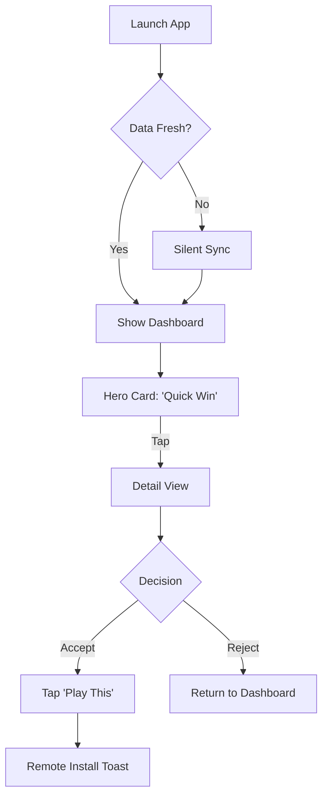
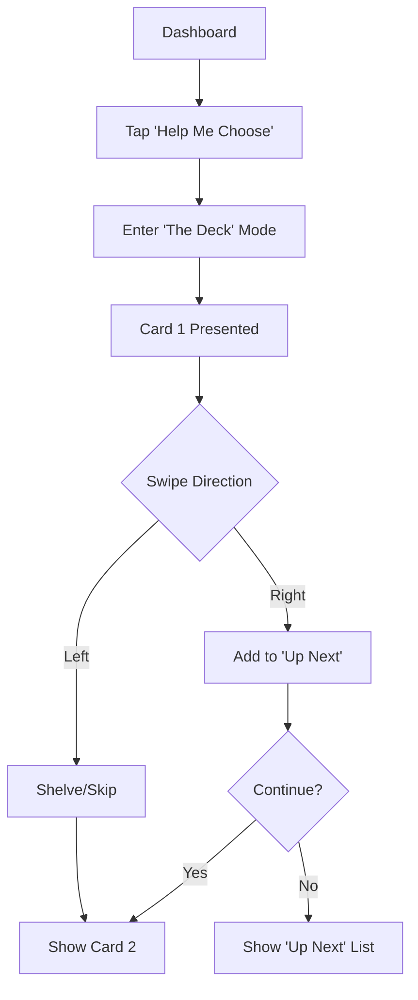
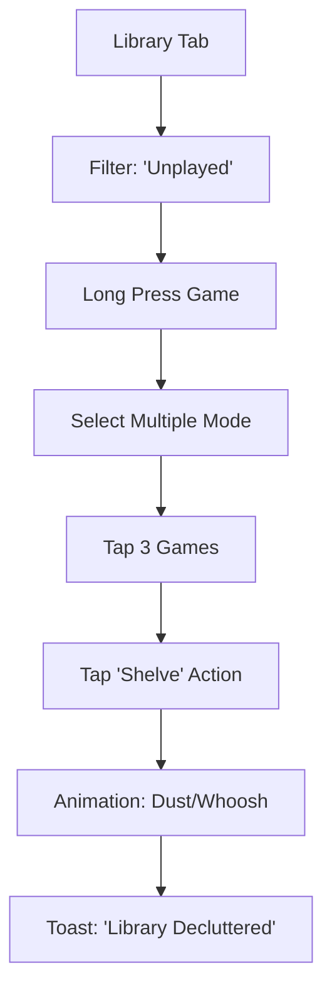

# UX Design Specification BacklogCompanion

**Author:** m.lazarau
**Date:** 2026-02-24

---

## 1. Project Understanding

### 1.1 Executive Summary
BacklogCompanion is a mobile "gaming concierge" designed to solve the "analysis paralysis" of modern PC gaming. It connects directly to a user's Steam library to transform a passive list of unplayed games into an active, curated source of entertainment. By leveraging context-aware AI reasoning and practical data like "How Long To Beat," it helps users shop their own shelf, finding the right game for their current time and mood without purchasing new titles.

### 1.2 Target Audience
*   **Primary User (Alex - "The Saturated Strategist"):** experienced gamer with a massive library (500+ games), limited play time, and high decision fatigue. They need a trusted filter to identify high-quality experiences they already own but have overlooked.
*   **Secondary User (Sam - "The Deal Hunter"):** Budget-conscious gamer with a backlog of bundles. They need validation that an older or cheaper title is worth their time investment compared to new releases.

### 1.3 Key Features
*   **AI Recommendation Engine:** Generates specific play suggestions (e.g., "Quick Win," "Forgotten Gem") based on user taste and library constraints.
*   **Contextual Feasibility:** Integrates playtime estimates to help users match games to their available free time.
*   **Backlog Management:** Simple tools to organize games by status (Backlog, Playing, Completed, Shelved) and track progress.
*   **Clean Mobile Interface:** A distraction-free environment focused solely on decision-making, separate from the marketing-heavy PC store experience.

### 1.4 Design Challenges
*   **Trust & Transparency:** The AI's recommendations must be explained clearly ("Why this game?") to build user confidence in the curation.
*   **Focus vs. Clutter:** The UI must be radically simpler than the Steam Store, avoiding information overload (the "Newspaper Spread" effect).
*   **Speed to Play:** The interaction loop from launch to decision must be under 1.5 seconds to prevent users from defaulting to passive media consumption.

---

## 2. Core Experience Definition

### 2.1 Core User Action: The "Launch-to-Decision" Loop
The fundamental value of BacklogCompanion is eliminating choice paralysis. The critical success path is the user launching the app and accepting a recommendation within seconds, not minutes.
*   **Success Definition:** The user taps "Play This" or "Install" on a recommended game.
*   **Failure Definition:** The user opens the app, scrolls through a list, and closes it (or opens another app).
*   **UI Implication:** The Home Screen must prioritize a single, high-confidence recommendation (or a very short list) over a dense library view.

### 2.2 Effortless Integration
Data synchronization must be magical and invisible.
*   **Seamless Sync:** The user shouldn't feel the "fetch" from Steam. The library should be available instantly, even offline.
*   **Contextual Intelligence:** The app leverages metadata (HowLongToBeat, Metacritic) without the user needing to manually input it.
*   **Platform Feel:** Native mobile interactions (swipes, haptics) replace the desktop-centric "mouse and keyboard" feel of Steam.

### 2.3 Experience Principles
1.  **Decision Over Display:** We are curators, not librarians. The UI prioritizes *one* high-confidence recommendation over a comprehensive list of options.
2.  **Instant Gratification (The 1.5s Rule):** The app launches directly into usable content. Waiting is failure.
3.  **Context is King:** Every recommendation must answer "Why now?" using data (time available + taste match). Raw data is useless without context.
4.  **Tactile Satisfaction:** Marking a game as "Played" or "Completed" should feel rewarding (haptics, animation)—a digital checked box on a life goal.

---

## 3. Desired Emotional Response

### 3.1 The "Concierge" Persona
The app's tone and interaction style should mimic a high-end concierge or a knowledgeable librarian. It is helpful, polite, brief, and data-backed. It avoids "gamified" retention tactics.
*   **Tone:** "I have prepared this for you," not "DO THIS NOW."
*   **Feeling:** "This app respects my time and intelligence."

### 3.2 Converting Guilt to Efficiency (The "Smart" Feeling)
The user should feel *clever* for using their library properly, rather than guilty for having a backlog.
*   **The Moment:** Seeing a "Quick Win" (2 hours to beat) that fits perfectly into their schedule.
*   **The Emotion:** "Oh, I can actually finish this tonight. That's a smart use of my time."

### 3.3 The Joy of "Letting Go" (Liberation)
We design the "Shelve" or "Abandon" interaction to feel positive, like cleaning a closet. You don't *have* to play everything.
*   **The Action:** Moving a game to "Shelved."
*   **The Feedback:** A satisfying sound/animation. A message that reinforces decluttering.
*   **The Emotion:** A weight lifted. "It's okay to let this go."

### 3.4 Soft Authority (Trust)
The AI recommendations must be suggestions, not commands, to make the user feel *understood* rather than *managed*.
*   **Wording:** "You might like..." instead of "Play this." "Because you played X..." instead of "Computer says Y."
*   **Transparency:** Always show *why*. The rationale builds trust.

---

## 4. UX Pattern Analysis

### 4.1 Inspiration Sources
We are drawing inspiration from apps that solve "choice overload" and present clear, binary decisions.

1.  **Netflix (Curated Discovery):**
    *   **The Idea:** The "Hero Banner" approach. The best recommendation occupies 50% of the screen.
    *   **The Pattern:** "Because you watched X..." context strings.
    *   **Application:** Home Screen features a prominent "Top Pick for Tonight" rather than a dense list.

2.  **Tinder/Bumble (Binary Decision):**
    *   **The Idea:** "One Card at a Time."
    *   **The Pattern:** Reduces 500 options to 1 choice. Forces a Yes/No interaction.
    *   **Application:** A "Help Me Choose" mode that presents games sequentially rather than as a grid, preventing analysis paralysis.

3.  **Uber Eats (Data Density):**
    *   **The Idea:** Clean presentation of complex metadata (Rating, Time, Price, Cuisine).
    *   **The Pattern:** Uses pills, tags, and clear typography to make data scanable without clutter.
    *   **Application:** Game Cards use standardized "Pills" for HLTB times, Metacritic scores, and Genre tags.

### 4.2 Core UX Patterns
*   **Hybrid Home:** A Netflix-style hero section + horizontal scrolling carousels for context (e.g., "Quick Wins," "RPG Weekend").
*   **Discovery Mode:** A dedicated "Swipe-like" interface for rapid decision-making when the user is stuck.
*   **Card Architecture:** Clean, high-contrast cards with pill-shaped data tags (Uber Eats style) to communicate value instantly.

---

## 5. Design System Strategy

### 5.1 Design Approach: "Lightweight Branded"
We choose a **Custom Utility-First** design system strategy to achieve a high-fidelity "branded" look (like Spotify/Netflix) without sacrificing performance on mid-range devices.

*   **Rationale:** Standard UI kits (Material/iOS) look generic and don't match the "Concierge" emotional goal. Heavy cross-platform kits (Tamagui) add too much runtime overhead for our speed goals (1.5s launch).
*   **Visual Logic:** The app maintains a consistent visual identity across iOS and Android, rather than adapting to platform-specific norms (e.g., matching typography, spacing, and component styles).

### 5.2 Technical Foundation
*   **Styling Engine:** `NativeWind` (Tailwind for React Native) ensures zero-runtime overhead while allowing rapid development of custom interfaces.
*   **Core Components:** We build a focused set of ~15 high-quality, reusable components (Card, Button, Pill, List, Rating) tailored exactly to our needs.
*   **Iconography:** `react-native-vector-icons` provides lightweight, scalable icons.
*   **Motion:** `react-native-reanimated` handles crucial micro-interactions (swipes, card parallax) at 60fps on the UI thread.

---

## 6. The Defining Experience: "The Adaptive Concierge"

### 6.1 The Core Interaction: Confidence-Based Launch
The app's entry point is not static; it adapts to the likely confidence level of the user to minimize friction.

*   **Scenario A (Low Confidence/No recent data):**
    *   **UI:** A mood-check question (e.g., "Short session or Epic journey?").
    *   **Goal:** Immediate filtering to prevent browsing paralysis.
*   **Scenario B (Medium/High Confidence):**
    *   **UI:** The "Concierge Dashboard" (Netflix Style).
    *   **Content:** "We found 3 perfect matches for tonight." A hero recommendations + 2-3 specific rows (e.g., "Quick Wins").
*   **Scenario C (The "Help Me Choose" Mode):**
    *   **UI:** Users can enter a dedicated "Swipe" mode (Tinder-like) if the dashboard options don't click.
    *   **Goal:** Rapid binary sorting (Yes/No) to force a decision.

### 6.2 The "Aha!" Moment (Validation)
The detail view triggers the decision by validating *Time* and *Taste*.
*   **The Hook:** "You bought this 3 years ago and never played it." (Nostalgia/Value).
*   **The Check:** "Time to beat: 4 hours." (Feasibility).
*   **The Result:** The user feels a sense of *discovery* ("This has been waiting for me!") and *relief* ("I can actually do this.").

### 6.3 The Exit (Commitment)
*   **Action:** Tapping "Play This" (or "Install").
*   **Emotion:** Settled. The anxiety of choice is gone. The evening is planned.

---

## 7. Visual Foundation

### 7.1 Concept: "Modern Steam"
The visual identity bridges familiar gaming aesthetics with modern app design. We use a **Deep Blue/Dark Grey** palette reminiscent of the Steam client to build instant trust ("This is my library"), but modernize it with cleaner typography and softer shapes.

### 7.2 Color System
*   **Backgrounds:**
    *   `Surface-900` (#171A21 - Steam Dark Blue/Grey) - Main Background.
    *   `Surface-800` (#2A475E - Steam Light Blue) - Cards/Elevated Surfaces.
*   **Accents:**
    *   `Primary`: #66C0F4 (Steam Light Blue) - Actions/Links.
    *   `Success`: #A3E635 (Lime) - "Play This" / Recommendations.
    *   `Destructive`: #F87171 (Soft Red) - Shelve/Ignore.
*   **Text:**
    *   `Text-100`: #FFFFFF (White) - Primary Content.
    *   `Text-300`: #C7D5E0 (Light Grey Blue) - Metadata & Descriptions.

### 7.3 Typography: Friendly Tech
*   **Typeface:** **Rubik** (Rounded Sans).
    *   *Rationale:* Softens the "data-heavy" nature of a backlog manager. It feels like a *consumer product* (friendly, approachable) rather than a *spreadsheet*.
*   **Scale:**
    *   `H1`: 32px (Hero Game Titles)
    *   `H2`: 24px (Section Headers)
    *   `Body`: 16px (Descriptions)
    *   `Caption`: 12px (Metadata/Pills) - UPPERCASE TRACKING for scannability.

### 7.4 Spacing & Shape
*   **Radius:** 12px-16px (Soft, rounded cards). Matches the rounded typeface.
*   **Density:** Airy. 16px padding inside cards, 24px between sections. The UI breathes to reduce overwhelm.

---

## 8. Design Directions

### 8.1 Primary UI: "The Smart Assistant" (Default Home)
The default experience balances curation with agency, building trust through transparency.
*   **Structure:** A "Concierge Greeting" header ("Good evening, Alex. You have 2 hours.") followed by a vertical stack of high-context horizontal lists.
*   **Hero Content:** A "Reason" card (e.g., "Quick Win for Tonight") rather than just a raw game title.
*   **Vibe:** Helpful, organized, transparent. "I'm here to help, not sell."

### 8.2 Variant UI: "The Immersive Theater" (High Confidence >95%)
When the AI is extremely confident in a recommendation, the UI adapts to be more persuasive.
*   **Trigger:** Recommendation Confidence > 95% (e.g., massive taste match + owned game).
*   **Structure:** The top card expands to take 60% of the viewport. Background fades into the game art.
*   **Goal:** To push the user over the edge on a *perfect* match by evoking emotion.

### 8.3 Interaction Mode: "The Deck" (Discovery Tool)
A dedicated mode for overcoming "Analysis Paralysis" when the dashboard fails.
*   **Trigger:** Tapping "Help Me Choose" or "I'm Bored."
*   **Structure:** Modal view with a single card stack. Swipe Left (Shelve/Skip) / Swipe Right (Play/Save).
*   **Goal:** Gamified, binary decision making. "Yes or No?" removes the complexity of "Which of these 500?"

---

## 9. User Journey Flows

### 9.1 Flow 1: The "Launch-to-Decision" (Happy Path)
The critical primary loop for a returning user with high trust.

### 9.2 Flow 2: The "Help Me Choose" (Discovery Path)
When the user rejects the initial recommendation and needs active assistance.

### 9.3 Flow 3: The "Backlog Cleanup" (Management Path)
The administrative flow for reducing clutter (The "Liberation" emotion).

---

## 10. Component Strategy & Architecture

### 10.1 Strategy: Utility-First Super-Components
Since we are using `NativeWind`, we will build a small set of highly reusable "Super-Components" tailored to our specific data needs (Steam/HLTB), rather than using a generic UI kit.

### 10.2 The Game Card (The Core Unit)
*   **Purpose:** The primary interactive element representing a game.
*   **Variants:**
    *   **Hero (Home):** 3:4 Aspect Ratio. Full bleed art. Title + HLTB Pill + "Why" Bubble.
    *   **Deck (Discovery):** Full Screen. Simplified. Focus on Art + Binary Action buttons.
    *   **List (Library):** Compact Web-style row. Square Art + Title + Status + HLTB Pill.
*   **Interaction:**
    *   **Tap:** Open Detail View.
    *   **Long Press:** Context Menu (Shelve/Play Next/Add to Queue).

### 10.3 The Omni-Pill (Smart Metadata Tag)
*   **Purpose:** To make dense metadata scannable without cluttering the art.
*   **Visual Logic (HLTB):**
    *   **Short (< 10h):** Green + "4h" icon.
    *   **Medium (10-40h):** Yellow + "25h" icon.
    *   **Long (> 40h):** Red + "80h" icon.
    *   **Endless/Live Service:** Blue + "∞" icon (For MMOs/Roguelikes/Ongoing games where completion is undefined).
*   **Style:** Blur/Glass background on top of game art for high legibility on any cover.

### 10.4 The Concierge Bubble (AI Voice)
*   **Purpose:** To transparently explain *why* a game is recommended.
*   **Style:** Distinct from game data. Uses a consistent "Sparkle" icon to denote AI generation.
*   **Content:** Short, conversational text. "Fast-paced action like Doom."

---

## 11. UX Consistency Patterns

### 11.1 Navigation Architecture
*   **Primary Structure:** Bottom Tab Bar (3 Tabs max).
    1.  **Home:** The Concierge Dashboard (Discovery).
    2.  **Library:** The Management List (Search/Filter).
    3.  **Profile:** Stats + Settings + Preferences (Identity).
*   **Top Bar:** Minimal or Transparent on Home Screen to maximize immersive artwork space.

### 11.2 Feedback & Empty States
*   **Sync Loading (<3s):** Skeleton Shimmer (Rectangles matching card shapes) to imply structure. No generic spinners.
*   **Long Loading (>3s):** "Cinema Mode." If sync takes time, fade in "Upcoming Releases" or "Did you know?" trivia to entertain the user.
*   **Zero State (No Unplayed Games):** The Concierge pivots to *Replay Value*. Suggests games with < 100% achievements or high replayability. "Time for a victory lap?"

### 11.3 Actions & Undo
*   **Destructive Actions (Shelve):** Immediate execution with a non-blocking **Toast/Snackbar** + **UNDO** button. No confirmation dialogs to slow down cleanup.
*   **Positive Milestones:** Full-screen overlay (Confetti/Particles) when a game is marked "Completed" or a major backlog goal is hit.

---

## 12. Responsive & Accessibility Strategy

### 12.1 Mobile-First MVP Strategy
The initial release targets **Phone Portrait Mode** exclusively. Tablet optimization (Grid/Split Views) is out of scope for MVP. The UI will scale gracefully on larger screens but maintain the single-column stack layout to speed up development.

### 12.2 Accessibility (A11y) Foundation
*   **Dynamic Type Support:** All text containers, especially "Pills" and Cards, must expand vertically to support user font scaling up to 200%. Fixed heights are forbidden for text elements.
*   **Contrast Compliance:** All text colors must pass **WCAG AA (4.5:1)** against the dark backgrounds. The primary "Steam Blue" accent will be tuned to `Sky-400` lightness to ensure readability on dark grey.
*   **Motion Sensitivity:**
    *   **Reduced Motion:** Animations (Confetti, Swipes) are disabled if the system setting `prefers-reduced-motion` is active.
    *   **Alternative Inputs:** Swipe gestures (Deck Mode) are supplemented by visible tap buttons (e.g., arrow keys) for users with motor impairments.

<!-- UX design content will be appended sequentially through collaborative workflow steps -->
